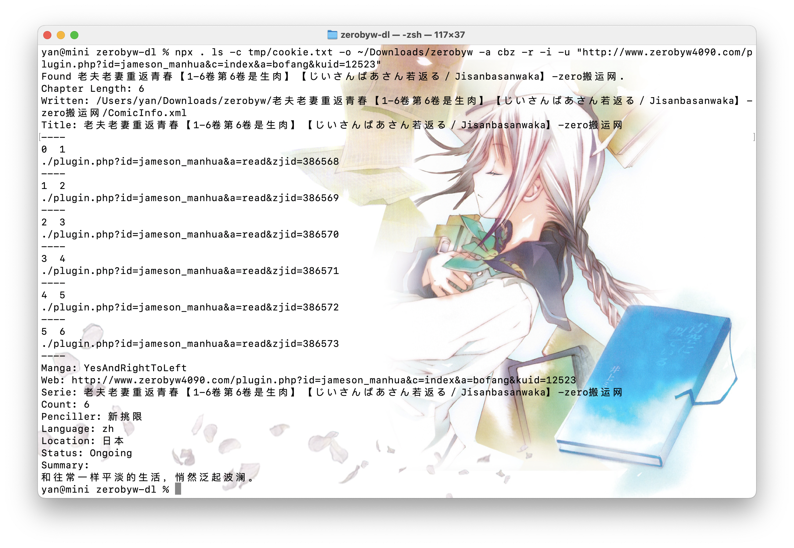
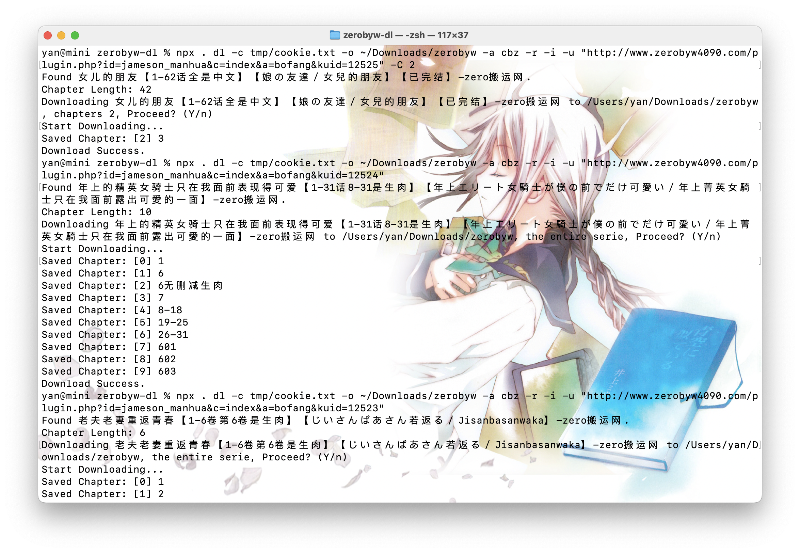

# comic-dl

[](https://www.npmjs.com/package/comic-dl)


As of the version 2, **`zerobyw-dl` now becomes `comic-dl`.** Now this library is for generic uses.

Looking for `zero-byw`? [Check here](https://github.com/yinyanfr/comic-dl/tree/v1).

This library is not for browsers.

## :star2: Features

- CLI tools
- Supports multiple sites (More on the road).
- Download as ZIP/CBZ, or just a folder of pictures
- Downloading progress watch
- Generates [ComicInfo.xml](https://anansi-project.github.io/docs/comicinfo/intro)

## Site List

- [Zerobyw](https://zerobyw.github.io/)
- [Copymanga](https://www.copymanga.site/)

## :framed_picture: Gallery

### List of chapters



### Downloading



## :green_book: Quick Start

You need Node.js (LTS or the current version) to run this project.

```bash
npm i zerobyw-dl
# or
# CLI
npx zerobyw-dl help
```

## :wrench: Cli

```
  Usage: comic-dl [options] [command]

  Commands:
    chapter, c, ch   Download images from one chapter.
    download, d, dl  Download chapters from a manga serie.
    help             Display help
    list, l, ls      List all chapters of a manga serie.
    version          Display version

  Options:
    -a, --archive           Optional: Output zip or cbz archive grouped by chapters.
    -b, --batch             Optional: Set the number or images to be downloaded simultaneously, default to 1.
    -C, --chapters          Optional: Only downloading given list of chapters, example: -C 1,2,4,7
    -c, --cookie            Optional (but recommanded): Provide the path to a text file that contains your cookie.
    -F, --format            Optional: the format of downloaded picture, depending on the modules, example: webp / jpg.
    -f, --from              Optional: Starting chapter when downloading a serie, default to 0.
    -h, --help              Output usage information
    -i, --info              Optional: Generate ComicInfo.xml.
    -M, --max-title-length  Optional: restrict the length of title as the folder name.
    -m, --module            Optional: Specify the module (site) name. Will attempt to detect module by url if not set.
    -n, --name              Optional: Proride the serie title and override the folder name.
    -o, --output            Optional: The path where downloaded files are saved (default to .), setting this flag when using list will save a ComicInfo.xml to the path.
    -r, --retry             Optional: Automatically re-download chapters with failed images.
    -s, --slience           Optional: Silence the console output, including the confirm prompt.
    -T, --timeout           Optional: Override the default 10s request timeout.
    -t, --to                Optional: Ending chapter when downloading a serie, defaults to chapter.length - 1.
    -u, --url               The url to the serie or the chapter.
    -v, --verbose           Optional: Display detailed error message, overrides silence.
    -V, --version           Output the version number
    -y, --yes               Optional: Skipping confirmation prompt when downloading series.
    -z, --zip-level         Optional: zip level for archive, default to 5.

  Examples:
    - Download a serie from its 10th chapter to 20th chapter to the given destination, 10 images at a time, output zip archives with ComicInfo.xml by chapter, retry if a chapter is not properly downloaded.
    $ npx comic-dl dl -c cookie.txt -f 10 -t 20 -o ~/Download/manga -a zip -r -i -b 10 -u serie_url

    - Download chapter index 0, 4, 12 from a serie
    $ npx comic-dl dl -c cookie.txt -o ~/Download/manga -i -u serie_url -c 0,4,12

    - List all chapters of the given serie.
    $ npx comic-dl ls -u serie_url

    - Download a chapter named Chapter1 to current path.
    $ npx comic-dl ch -n Chapter1 -u chapter_url -c cookie.txt
```

## :book: Library

### Initializing downloader

```typescript
import ZeroBywDownloader from "zerobyw-dl";

// Path for downloaded files
const destination = "~/Download/zerobyw";
// Configs
const configs = {
  // Get your cookie from the network inspector of your browser
  // Optional but highly recommanded, as ZeroByw partially blocks content for non-paid users
  cookie: "your_cookie",
  // Request timeout in ms (Optional: default to 10 seconds)
  timeout: 10000,
  // Silencing console output (Optional)
  silence: false,
  // numbers of images to be downloaded simultaneously (Optional: default to 10)
  batchSize: 10,
  // Display detailed error message, will override silence (Optional)
  verbose: false,
  // Output zip or cbz archives grouped by chapters (Optional)
  archive: "zip",
  // Additional headers for HTTP Requests (Using axios under the hood) (Optional)
  headers: {},
  // Restrict the length of title's length, in case your file system has such limitation (Optional: default to undefined)
  maxTitleLength: 30,
  // Zip level for archives (Optional: default to 5)
}; // Optional

const downloader = new ZeroBywDownloader(destination, configs);
```

### :scroll: Getting serie info

```typescript
const options = {
  output: "output_path", // Optional: Set this to write a ComicInfo.xml to the path, use true to output to the inherited destination folder
  // By default, the file is downloaded to destination/serie_title/ComicInfo.xml
  rename: "serie_title", // Optional: Override the serie title folder name
  filename: "ComicInfo.xml", // Optional: Overrides the default file name
};

const info = await downloader.getSerieInfo("serie_url");
// info
// {
//   title: "Serie Title",
//   chapters: [{
//     index: 0,
//     name: "Chapter Name",
//     uri: "chapter_uri", // without baseUrl
//   }],
//   info: {} // please refer to ComicInfo's Documentations
// }
```

### :books: Downloading from a serie

```typescript
const options = {
  start: 10, // Optional: Starting chapter, inclusive, default to 0
  end: 20, // Optional: Ending chapter, inclusive, default to the last (length - 1)
  confirm: false, // Optional: Launch a console prompt asking for user's confirmation before starting downloading, default to false
  rename: undefined, // Optional: Changing the folder name, default to undefined
  retry: false, // Optional: Automatically re-download chapters with failed images.
  info: true, // Optional: Generates ComicInfo.xml, default to **false**
  chapters: undefined, // Optional: Automatically re-download chapters with failed images
  onProgress: (progress) => {
    console.log(progress);
  }, // Optional: Called when a chapter is downloaded or failed to do so
}; // Optional

// progress
// {
//   index: 0, // chapter index
//   name: "Chapter Name",
//   uri: "chapter_uri",
//   status: "completed", // or "failed"
//   failed: 1, // numbers of images failed to be downloaded
//   // status is completed as the download queue is cleared, even with failed images.
// }

// Download all chapters from a serie
await downloader.downloadSerie("serie_url");

// Download from the 10th to the 20th chapter (11 chapters in total)
await downloader.downloadSerie("serie_url", options);
```

### :bookmark: Downloading a chapter

```typescript
const options = {
  index: 0, // chapter index
  title: "Serie Title",
  info: ComicInfo, // Optional: Generates ComicInfo.xml, please refer to ComicInfo's Documentations
  onProgress: (progress) => {}, // Optional: Called when a chapter is downloaded or failed to do so, the same as in serie options
}; // Optional

await downloader.downloadChapter(
  "Chapter Name",
  "chapter_url_with_base",
  options
);
```

### :pencil2: Modify configs

```typescript
// change one config
downloader.setConfig("archive", "cbz");
// merge configs
downloader.setConfigs({ archive: "cbz" }); // Will merge
```

## :information_source: Information

- [ComicInfo.xml Documentations](https://anansi-project.github.io/docs/comicinfo/intro)
